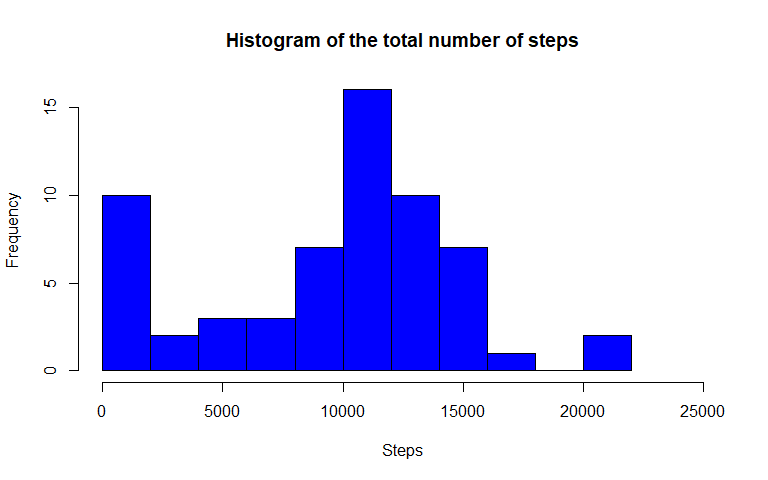
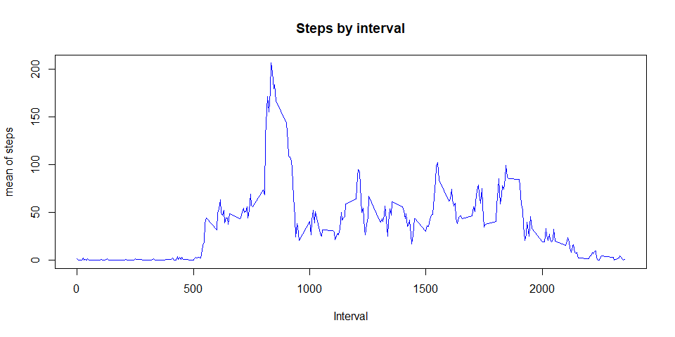
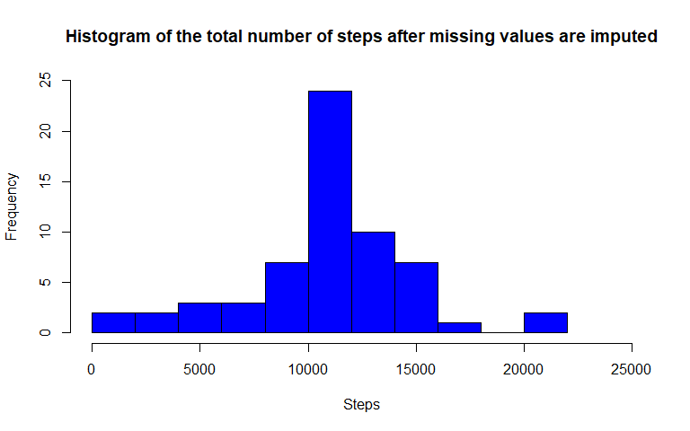
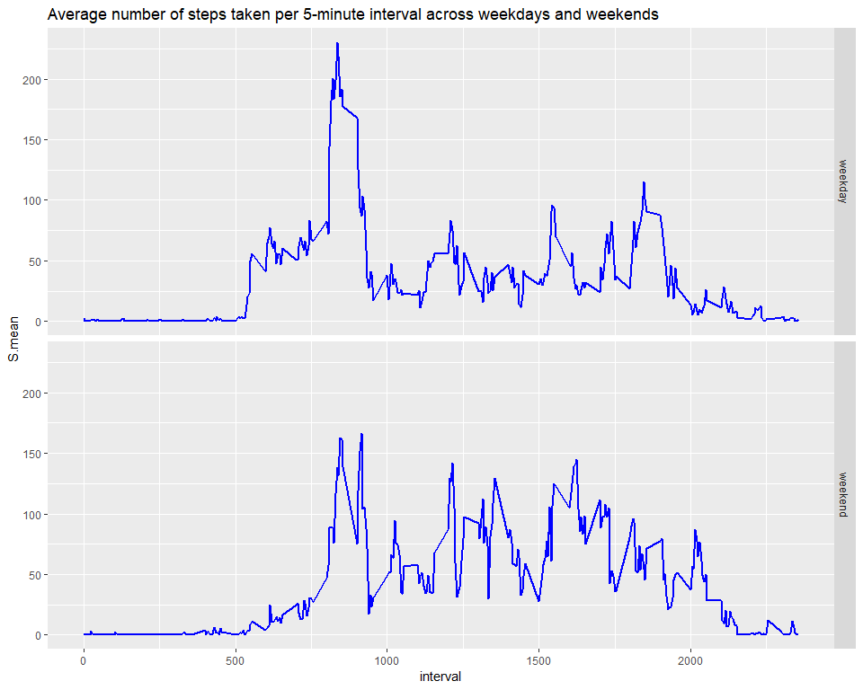

### Loading and preprocessing the data


```r
library(data.table)
library(lubridate)
```

```
## 
## Attaching package: 'lubridate'
```

```
## The following objects are masked from 'package:data.table':
## 
##     hour, isoweek, mday, minute, month, quarter, second, wday,
##     week, yday, year
```

```
## The following object is masked from 'package:base':
## 
##     date
```

```r
library(ggplot2)
unzip("activity.zip", overwrite = TRUE)
activity <- fread("activity.csv")
activity[, date:=ymd(date)]
```
### Histogram of the total number of steps taken each day

```r
date_avg=activity[,.(Sum.steps=sum(steps, na.rm = TRUE)), by=date]
hist(date_avg$Sum.steps, xlab = "Steps", main = "Histogram of the total number of steps", col = "blue", xlim = c(0,25000), breaks = 12)
```

<!-- -->

### Mean of the total number of steps taken per day

```r
mean(date_avg$Sum.steps, na.rm = TRUE)
```

```
## [1] 9354.23
```

### Median of the total number of steps taken per day

```r
median(date_avg$Sum.steps, na.rm = TRUE)
```

```
## [1] 10395
```

### Time series plot of the average number of steps taken

```r
int_avg=activity[,.(S.mean=mean(steps, na.rm = TRUE)), by=interval]
with(int_avg, plot(interval, S.mean, type = "l", col="blue", lwd =1, main = "Steps by interval", xlab="Interval", ylab = "mean of steps"))
```

<!-- -->

### The 5-minute interval that, on average, contains the maximum number of steps

```r
int_avg[S.mean==max(int_avg$S.mean),]
```

```
##    interval   S.mean
## 1:      835 206.1698
```

### Imputing missing values
At first, the total number of observations with missing value was counted.

```r
activity[is.na(steps), .N]
```

```
## [1] 2304
```
In this task, the missed values were replaced by the average value for the corresponding interval.

```r
activity2=activity[,mean:=mean(steps, na.rm = TRUE),by=interval]
activity2[is.na(steps), steps:=as.integer(round(mean, 0))]
```

### Histogram of the total number of steps taken each day after missing values are imputed

```r
date_avg2=activity2[,.(Sum.steps=sum(steps, na.rm = TRUE)), by=date]
hist(date_avg2$Sum.steps, xlab = "Steps", main = "Histogram of the total number of steps after missing values are imputed", col = "blue", breaks = 12, xlim = c(0,25000), ylim=c(0,25))
```

<!-- -->
### Mean of the total number of steps taken per day after missing values are imputed

```r
mean(date_avg2$Sum.steps, na.rm = TRUE)
```

```
## [1] 10765.64
```

### Median of the total number of steps taken per day after missing values are imputed

```r
median(date_avg2$Sum.steps, na.rm = TRUE)
```

```
## [1] 10762
```


### Panel plot comparing the average number of steps taken per 5-minute interval across weekdays and weekends

```r
activity2[,wday:=weekdays.Date(date)]
activity2[wday=="суббота"|wday=="воскресенье", wday:="weekend"]
activity2[wday!="weekend", wday:="weekday"]
wday_avg=activity[,.(S.mean=mean(steps)), by=.(interval,wday)]
g<-ggplot(data=wday_avg, aes(interval,S.mean))
g+geom_line(size=1, color="blue")+facet_grid(wday~.)+ggtitle("Average number of steps taken per 5-minute interval across weekdays and weekends")
```

<!-- -->


